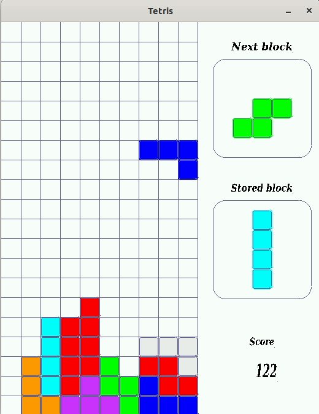

# Tetris

Implementation of Tetris game using pure C and the library SDL.

Controls:

* Left / Right arrow keys: move left / right
* Up key: Rotate block
* Down key: Hard drop
* Space key: Increase falling velocity
* S key: Save the current block
* P key: Pause

To build the game open the terminal in the Tetris folder, create a folder named ` build/ ` and type:

```
/path/to/tetris_in_pure_C $ cd build/

/path/to/tetris_in_pure_C/build $ cmake ..

```

If no errors appeared, then type:

```

/path/to/tetris_in_pure_C/build $ make

/path/to/tetris_in_pure_C/build $ ./main

```

**NOTE**: To build the project you will need:

* gcc compiler
* [cmake](https://cmake.org/download/)
* [SDL2](https://www.libsdl.org/download-2.0.php) library
* [SDL2_gfx](http://www.ferzkopp.net/Software/SDL2_gfx/Docs/html/index.html),
[SDL2_mixer](https://www.libsdl.org/projects/SDL_mixer/) and
[SDL2_ttf](https://www.libsdl.org/projects/SDL_ttf/)



    TODO:

    Addmusic and sound effects
    Add some animation when a line is completed
    Write the current level somewhere
    Improve the rendering of the side panel
